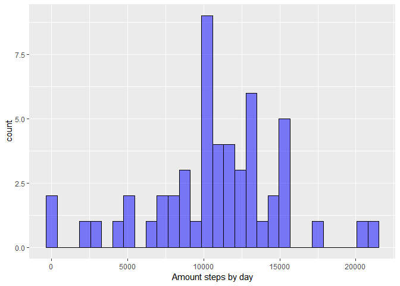
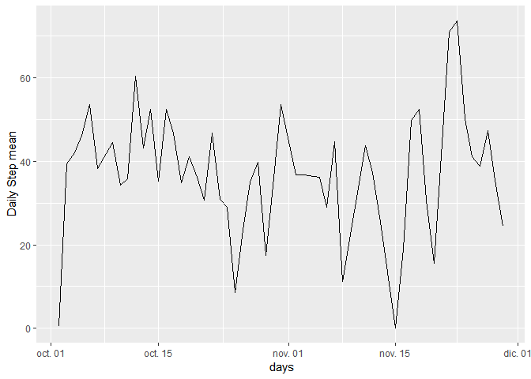
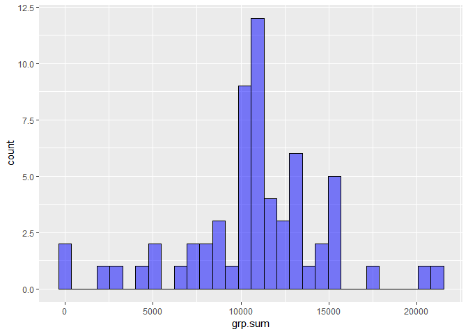
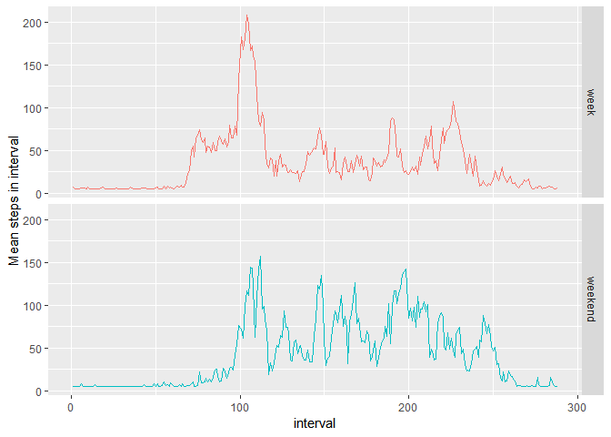

## Configure libraries and load data
First it is necessary to have installed and load the following libraries:

```r
library(plyr)
library(ggplot2)
library(openair)
```
After you need defining path  namespace that correspond at folder you dowload from my github and load de CSV file data:

```r
path="C:\\Users\\ebnaturi\\OneDrive - Universidad Juarez Autonoma de Tabasco\\courses\\esp-Data Science\\05_Reproducible Research\\project1"
setwd(path)
data = read.csv2("activity.csv",header=TRUE, sep = ",")
head(data)
```

```
##   steps       date interval
## 1    NA 2012-10-01        0
## 2    NA 2012-10-01        5
## 3    NA 2012-10-01       10
## 4    NA 2012-10-01       15
## 5    NA 2012-10-01       20
## 6    NA 2012-10-01       25
```

We observe that size of data variable:

```r
dim(data)
```

```
## [1] 17568     3
```
## What is mean total number of steps taken per day?
For this part of the assignment, you can ignore the missing values in the dataset.

1. Calculate the total number of steps taken per day.

```r
step_per_day <- ddply(data, "date", summarise, grp.sum=sum(steps))
head(step_per_day)
```

```
##         date grp.sum
## 1 2012-10-01      NA
## 2 2012-10-02     126
## 3 2012-10-03   11352
## 4 2012-10-04   12116
## 5 2012-10-05   13294
## 6 2012-10-06   15420
```

2.  total number of steps taken each day and plot the histogram. If you do not understand the difference between a histogram and a barplot, research the difference between them. Make a histogram of the total number of steps taken each day.


```r
step_per_day <- step_per_day[!is.na(step_per_day$grp.sum),]
g <- ggplot(step_per_day, aes(x=grp.sum)) + geom_histogram(color="black", fill="blue",alpha=0.5, bins=30)
g + xlab("Amount steps by day")
```

<!-- -->

3. Calculate and report the mean and median of the total number of steps taken per day.

```r
step_mean_day <- ddply(data, "date", summarise, grp.mean=mean(steps,na.rm = TRUE), grp.median=median(steps,na.rm = TRUE))
head(step_mean_day)
```

```
##         date grp.mean grp.median
## 1 2012-10-01      NaN         NA
## 2 2012-10-02  0.43750          0
## 3 2012-10-03 39.41667          0
## 4 2012-10-04 42.06944          0
## 5 2012-10-05 46.15972          0
## 6 2012-10-06 53.54167          0
```
## What is the average daily activity pattern?

1. Make a time series plot (i.e. `type = "l"`) of the 5-minute interval (x-axis) and the average number of steps taken, averaged across all days (y-axis).

```r
step_mean_day$date = as.Date(step_mean_day$date)
step_mean_day <- step_mean_day[!is.na(step_mean_day$grp.mean),]
ggplot(step_mean_day, aes(date, grp.mean)) + geom_line() + xlab(" days") + ylab("Daily Step mean")
```

<!-- -->

2. Which 5-minute interval, on average across all the days in the dataset, contains the maximum number of steps?

```r
data$interval =as.factor(data$interval)
step_5_minute_mean <- ddply(data, "interval", summarise, grp.mean=mean(steps,na.rm = TRUE))
max_step_per_day <- max(step_5_minute_mean$grp.mean,na.rm = TRUE)
subset(step_5_minute_mean, grp.mean==max_step_per_day)
```

```
##     interval grp.mean
## 104      835 206.1698
```

##Imputing missing values
Note that there are a number of days/intervals where there are missing values (coded as `NA`. The presence of missing days may introduce bias into some calculations or summaries of the data.

1. Calculate and report the total number of missing values in the dataset (i.e. the total number of rows with `NA`s). Check the columns with `NA`values, the column steps have 2304 *NA*, and the others zero.

```r
table(is.na(data$date))
```

```
## 
## FALSE 
## 17568
```

```r
table(is.na(data$steps))
```

```
## 
## FALSE  TRUE 
## 15264  2304
```

```r
table(is.na(data$interval))
```

```
## 
## FALSE 
## 17568
```
2. Devise a strategy for filling in all of the missing values in the dataset. The strategy does not need to be sophisticated. For example, you could use the mean/median for that day, or the mean for that 5-minute interval, etc. Fisrt separate NA files, second get not NA values, finally de NA values step in data is assign mean of data from without NA values. We display the table, You can see that non value NA exist.

```r
data_NA <- data[is.na(data$steps),]
dim(data_NA)
```

```
## [1] 2304    3
```

```r
data_out_NA <- data[!is.na(data$steps),]
dim(data_out_NA)
```

```
## [1] 15264     3
```
3. Create a new dataset that is equal to the original dataset but with the missing data filled in.

```r
data$steps[is.na(data$steps)] <- mean(data_out_NA$steps)
table(is.na(data$date))
```

```
## 
## FALSE 
## 17568
```

4. Make a histogram of the total number of steps taken each day and Calculate and report the mean and median total number of steps taken per day. Do these values differ from the estimates from the first part of the assignment? What is the impact of imputing missing data on the estimates of the total daily number of steps?

```r
step_per_day_out_NA <- ddply(data, "date", summarise, grp.sum=sum(steps))
ggplot(step_per_day_out_NA, aes(x=grp.sum)) + geom_histogram(color="black", fill="blue",alpha=0.5, bins=30)
```

<!-- -->

```r
step_per_day_out_NA_mean_median <- ddply(data, "date", summarise, average=mean(steps),med=median(steps))
head(step_per_day_out_NA_mean_median)
```

```
##         date  average     med
## 1 2012-10-01 37.38260 37.3826
## 2 2012-10-02  0.43750  0.0000
## 3 2012-10-03 39.41667  0.0000
## 4 2012-10-04 42.06944  0.0000
## 5 2012-10-05 46.15972  0.0000
## 6 2012-10-06 53.54167  0.0000
```
##Are there differences in activity patterns between weekdays and weekends?
For this part the `weekdays` function may be of some help here. Use the dataset with the filled-in missing values for this part.

1. Create a new factor variable in the dataset with two levels - "weekday" and "weekend" indicating whether a given date is a weekday or weekend day.

```r
data$date = as.Date(data$date)
data_out_NA_wk <- selectByDate(data, day = "weekday")
data_out_NA_wd <-selectByDate(data, day = "weekend")
dim(data_out_NA_wk)
```

```
## [1] 12960     3
```

```r
dim(data_out_NA_wd)
```

```
## [1] 4608    3
```

```r
data_out_NA_wk_mean <- ddply(data_out_NA_wk, "interval", summarise, grp.mean=mean(steps))
data_out_NA_wd_mean <- ddply(data_out_NA_wd, "interval", summarise, grp.mean=mean(steps))

data_out_NA_wk_mean$type = rep.int("week", length(data_out_NA_wk_mean$interval)) 
data_out_NA_wd_mean$type = rep.int("weekend", length(data_out_NA_wd_mean$interval)) 
total <- rbind(data_out_NA_wk_mean,data_out_NA_wd_mean)
total$type <- as.factor(total$type)
head(total)
```

```
##   interval grp.mean type
## 1        0 7.006569 week
## 2        5 5.384347 week
## 3       10 5.139902 week
## 4       15 5.162124 week
## 5       20 5.073235 week
## 6       25 6.295458 week
```
2. Make a panel plot containing a time series plot `type = "l"`of the 5-minute interval (x-axis) and the average number of steps taken, averaged across all weekday days or weekend days (y-axis). See the README file in the GitHub repository to see an example of what this plot should look like using simulated data.

```r
total$interval <- as.numeric(total$interval)
g <- ggplot(total, aes(x=interval,y=grp.mean, group = 1, color=type))  
g <- g + geom_line() + xlab("interval") + ylab("Mean steps in interval") 
g + facet_grid(type ~ .) + theme(legend.position="none")
```

<!-- -->
